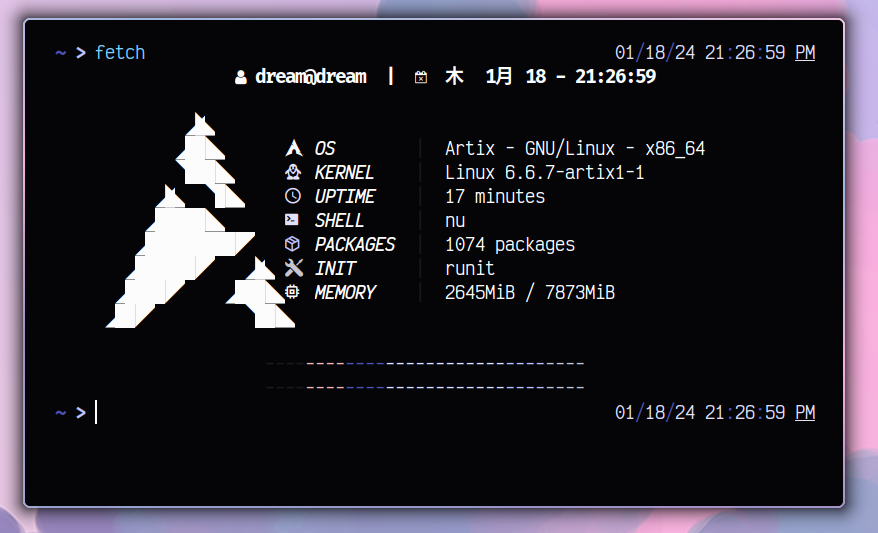
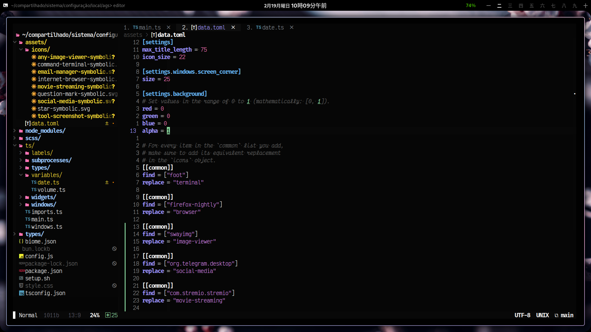

<h1 align="center">Wayland</h1>

---

<h3 align="center">lovemii</h3>

---

The [*nushell* script](https://www.nushell.sh/) called [magick.sh](./magick.sh) is a helper for the desktop, it will list all software and little disclaimers for what I use them in this system of applications.

---

# Wayland

## Evolution

---

# Xorg

I've stopped using X11 completly as of the start of 2024, previous history of this repository contains both configuration files and references to software I've used then.
