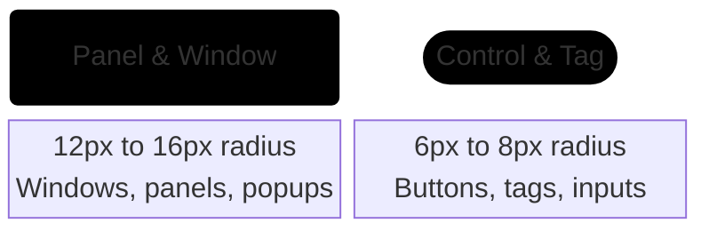

# 002: UI design system

- **Status:** Accepted
- **Date:** 2026-09-26
- **Deciders:** João V. Farias
- **Decision:** What will be the visual UI design system (colors, surfaces, typography, opacity, affordances)?

## Context

I need a clear visual direction for `lovemii`. The old shell worked, but the visuals were thrown together as I went. For this rewrite, I want a minimalist dark interface inspired by GNOME and Apple: clean curves, black backgrounds, and strong typography.

This record covers the visual foundation: color, surfaces, type scales, opacity levels, and how clickable items look. Interaction flows and UX behavior will get their own record later.

## Requirements and restrictions

- Pure black background for deep contrast and low power use on OLED screens;
- Light typography over dark surfaces, using white text with varying opacity;
- Rely on font weight, size, and opacity to show hierarchy and clickability instead of heavy borders, badges, or saturated background colors;
- Strictly monochrome for the interface chrome and text. Color is reserved for critical system warnings or errors;
- Crisp legibility at small sizes on the top bar and larger widget scales.

## Decision

I am setting the visual design rules for `lovemii` as follows:

### Colors and surfaces

- Background: Pure black for screen backing, floating panels, and popups.
- Borders: Hairline border using low-opacity white. No solid gray borders.
- Radii: Rounded corners for windows and panels, with tighter radii for controls and tags.
- Accent colors: None in the main interface. Chrome, text, and icons sta3y grayscale. Subdued red and amber are allowed only for critical errors and battery alerts.

```mermaid
block-beta
    columns 4
    bg_sq["&nbsp;"] bd_sq["&nbsp;"] err_sq["&nbsp;"] wrn_sq["&nbsp;"]
    bg_lbl["Background<br>#000000"] bd_lbl["Border<br>rgba(255, 255, 255, 0.10)"] err_lbl["Error<br>#CF6679"] wrn_lbl["Warning<br>#E5C07B"]

    style bg_sq fill:#000000,stroke:#333333,stroke-width:1px
    style bd_sq fill:#1A1A1A,stroke:#FFFFFF,stroke-width:1px
    style err_sq fill:#CF6679,stroke:#CF6679
    style wrn_sq fill:#E5C07B,stroke:#E5C07B
```

### Typography

Use a clean, neutral sans-serif with strong legibility at small sizes Inter.

The type scale has five tiers:

- Branding: 32px to 36px (app name, splash screen)
- Title: 18px to 20px (clock, main headers)
- Body: 13px to 14px (standard labels, menu rows)
- Caption: 11px to 12px (subtitles, secondary info, timestamps)
- Micro: 9px to 10px (category titles, fine metadata)

### Opacity and hierarchy

White text opacity against the black background indicates priority:

- Primary: Active headers, primary labels, current time.
- Secondary: Standard body text and unhighlighted labels.
- Tertiary: Subtitles, timestamps, and secondary hints.
- Inactive: Disabled actions, placeholders, and subtle dividers.

```mermaid
block-beta
    columns 4
    op_primary["&nbsp;"] op_sec["&nbsp;"] op_tert["&nbsp;"] op_dis["&nbsp;"]
    lbl_primary["Primary<br>100% White<br>#FFFFFF"] lbl_sec["Secondary<br>70% White<br>#B3B3B3"] lbl_tert["Tertiary<br>45% White<br>#737373"] lbl_dis["Inactive<br>25% White<br>#404040"]

    style op_primary fill:#FFFFFF,stroke:#FFFFFF
    style op_sec fill:#B3B3B3,stroke:#B3B3B3
    style op_tert fill:#737373,stroke:#737373
    style op_dis fill:#404040,stroke:#404040
```

### Clickable elements

Interactive text needs to stand out without cluttering the screen with button boxes:

- Font weight: Static labels use normal weight (400). Clickable items use medium (500) or semibold (600).
- Idle state: Clickable items rest at secondary opacity (around 75%) with medium weight.
- Hover state: Brightens to full white (100%) on hover for immediate feedback.
- Press state: Dims slightly (around 85%) or scales down by 2% on mouse down.

### Styles and decorations

- Section headers: Uppercase with wide letter spacing (0.5px to 1.0px) at micro or caption size, using tertiary opacity.
- Italics: Kept only for placeholders or empty-state text.
- Underlines: No underlines on buttons or UI text. Used only for hyperlinks on hover.

## Consequences

### Positives

- The pitch black surfaces and monochrome palette keep the shell clean, quiet, and easy on the eyes;
- Clear opacity and weight tiers make it obvious what is clickable without adding heavy button containers;
- Low power usage on OLED displays;
- Gives the desktop a cohesive look that matches modern GNOME and macOS styling.

### Negatives

- Low-opacity text (45% and 25%) might be hard to read on low-end displays or under bright glare;
- A strictly monochrome interface means spacing and type weights have to do all the heavy lifting, which leaves less room for sloppy layouts.
