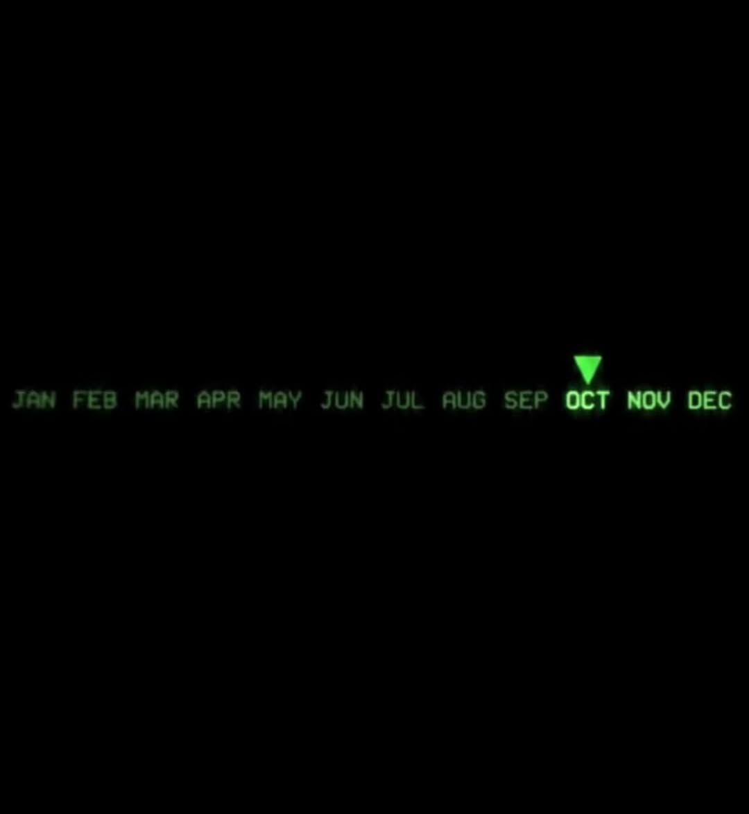

# 006: Time Tracker

- **Status:** Proposed
- **Proposal date:** Date of proposal
- **Proposed by:** List of people who made the feature

## Context

Provide context for what this feature is about, the motivation behind it, and the goal it aims to achieve.

## Benchmark

Provide examples of this feature implemented by other developers or in similar applications.

### [awatcher](https://github.com/2e3s/awatcher)

### [hyprtime](https://github.com/ayanrajpoot10/hyprtime)

### [hyprland-app-time-tracker](https://codeberg.org/beppi/hyprland-app-time-tracker)

### [Digital Wellbeing](https://play.google.com/store/apps/details?id=com.google.android.apps.wellbeing&hl=en&pli=1)

### Concepts

#### Month Pointer

A pointer that indicates the current month, with the others being grayed out. As a way to visualize the passage of time, inflict the feelingt that the user is either losing time or that time is passing by, and that the user should be aware of it.

## Interaction Flow

Describe the interaction flow of the feature in a use-case format.

## Visual Design

Provide visual design mockups or wireframes of the feature in Figma.

## Implementation

Provide a detailed description of how the feature will be implemented, including any technical considerations, dependencies, and potential challenges.
